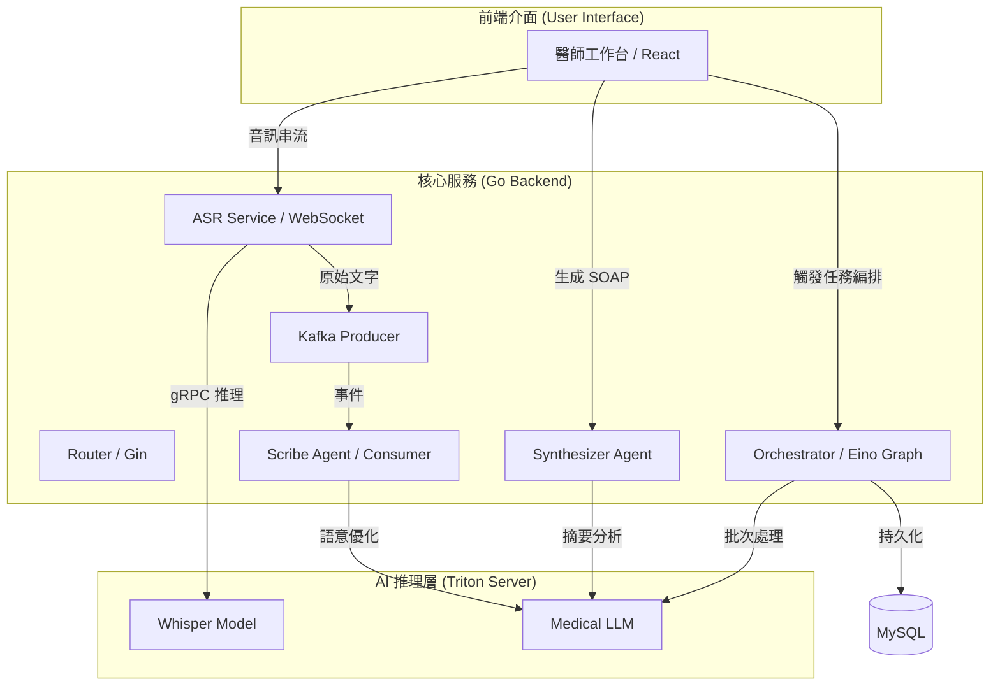
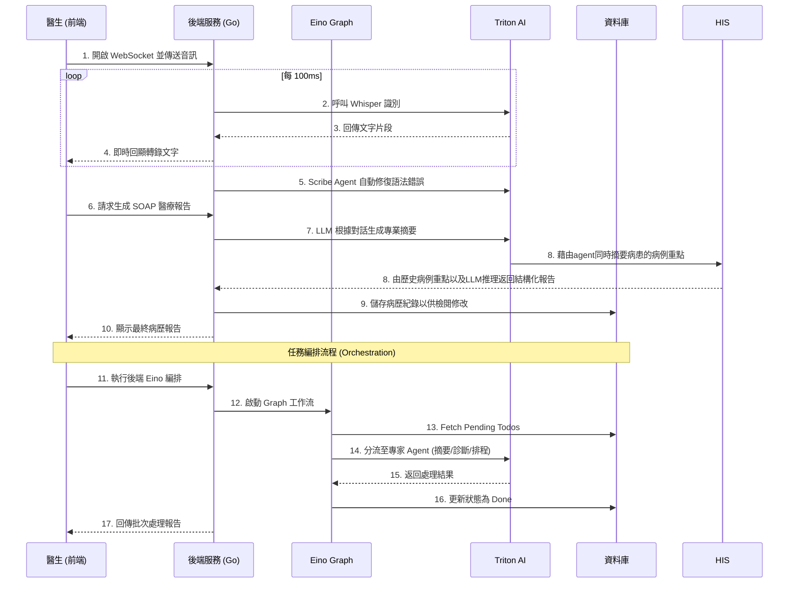

# 🩺 醫療 ASR 與 AI 醫師助手系統 (Medical ASR & Doctor Assistance System)

## 一、 系統簡介
本系統為醫療場景設計的即時語音轉錄與 AI 助手，旨在幫助醫師在診療過程中自動記錄病歷，並透過 AI 生成結構化的 SOAP 報告。系統採用 Go 語言開發後端，並結合 NVIDIA Triton Inference Server 進行高效能 AI 推理。

---

## 二、 系統架構與資料流 (Architecture & Data Flow)

### 1. 系統邏輯架構
系統採用微服務化與異步處理架構，確保語音轉錄的高可用性與低延遲。
**目前先以單體服務為主**

### 2. 即時處理流程
描述從醫師錄音到系統生成正式病歷與任務處理的完整路徑：

---

## 三、 功能實現狀態 (Feature Status)

| 模組 | 功能點 | 狀態    | 技術棧 |
| :--- | :--- |:------| :--- |
| **基礎架構** | 資料庫/緩存/Kafka 環境搭建 | ✅ 已完成 | MySQL, Redis, Kafka |
| **語音服務** | WebSocket 串流接收與 ASR 推理 | ✅ 已完成 | Whisper (目前有年包問題) |
| **認證系統** | 醫師註冊/登入 (JWT) | ✅ 已完成 | Gin, JWT |
| **AI Agents** | **Scribe Agent** (文字修正) | ✅ 已完成 | LLM, Kafka Consumer |
| **AI Agents** | **Synthesizer Agent** (SOAP 生成) | ✅ 已完成 | LLM, Agentic Workflow |
| **AI Agents** | **Orchestrator** (TODO 事項編排) | 未完成   | Eino Graph, Multi-Agent |
| **前端介面** | 錄音/即時轉錄/Dashboard | ✅ 已完成 | React, Vite, Tailwind |
| **AI 模型** | LLM 醫療微調與 Triton 配置 | ✅ 已完成 | NVIDIA Triton |

---

## 四、 技術棧總覽 (Technology Stack)

- **Backend**: Go (Gin)
- **Frontend**: React, Transformer js
- **AI Orchestration**: CloudWeGo Eino (Graph, Chain, Lambda)
- **AI Inference**: NVIDIA Triton Inference Server (gRPC)
- **AI Models**: Whisper, Medical-specific LLM(本機上使用Qwen2-5-0.5b)
- **Database**: MySQL (GORM), Redis
- **Message Queue**: Apache Kafka
- **Frontend**: React, Vite, Tailwind CSS, Lucide Icons
- **DevOps**: Docker, Docker Compose

---

## 五、 後續規劃 (Roadmap)

1. **RAG** 模組開發：整合外部醫療知識庫，提升 AI 回答的專業性與準確性。

2. **歷史病例分析**：利用 AI 分析過往病歷，提供診療建議與預測，增加模型病例分析準確性，以及當收到病患預約時能夠自動分析病患過往病歷，讓醫師不需要翻閱之前的資料。

3. **Stream**: 改善目前語音系統，使用streaming的方式即時產出SOAP